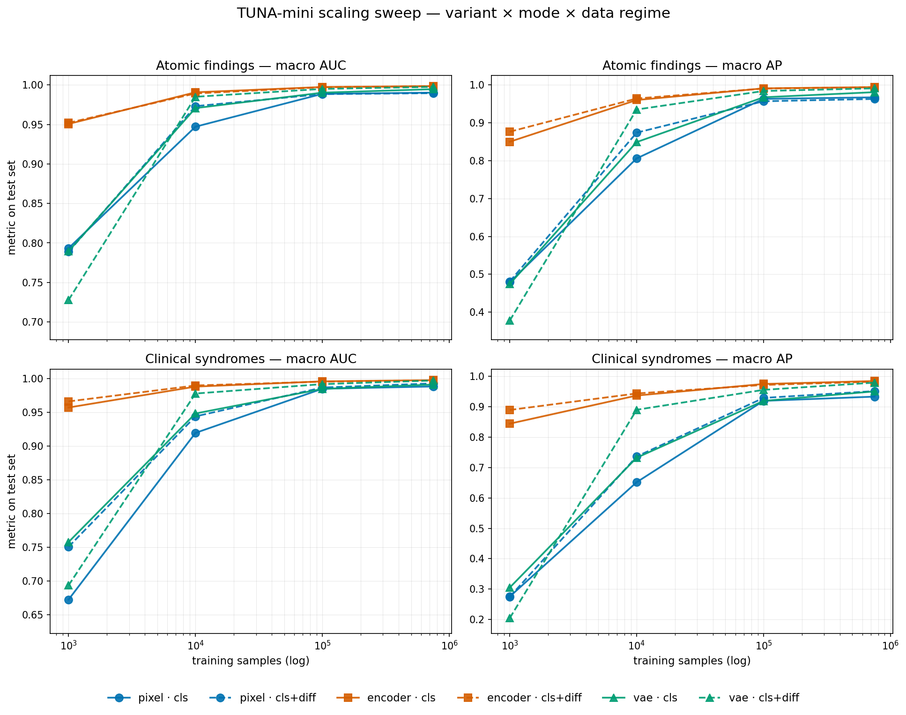
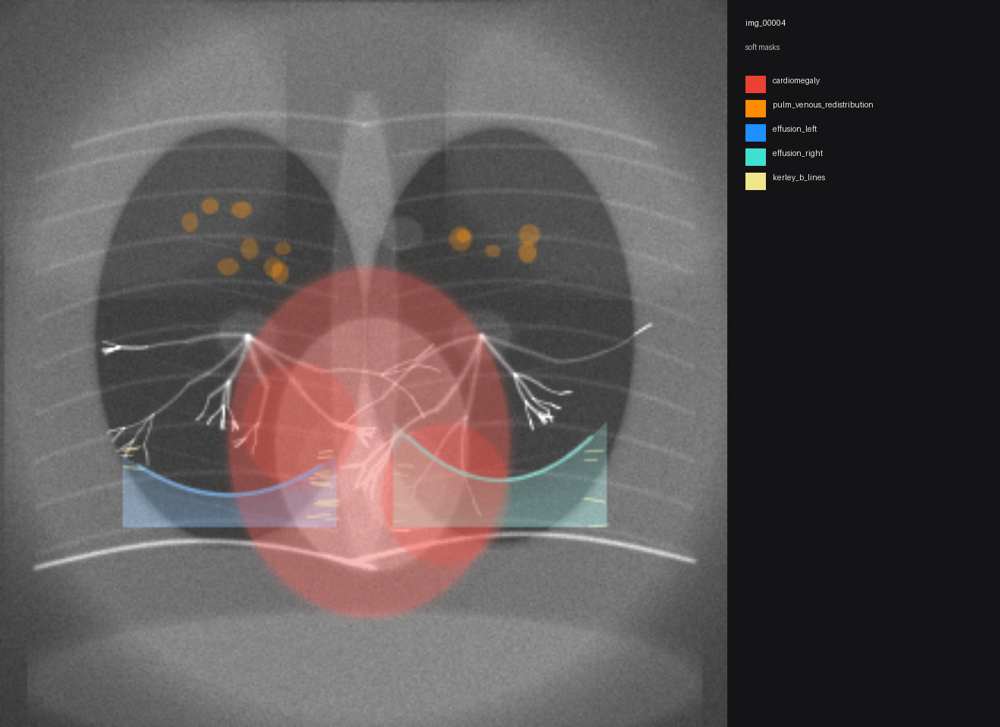

# Anchovy

> Does removing the vision encoder and feeding raw patches to a transformer pay off when you scale up the data? An empirical scaling study on synthetic chest radiographs.

**Headline finding.** With enough training data the gain from a pretrained image encoder saturates: a frozen DINOv2 ViT-S/14 front-end caps out at macro AP 0.990, and 25× more compute moves it by 0.001 in the wrong direction. Past that ceiling, patch size dominates. A purely-pixel transformer at the encoder's native 14×14 patches trails the encoder by 0.010 AP under matched compute. Switching to 8×8 patches — dropping the encoder entirely while spending 3× more tokens on the same input — **surpasses the encoder long run on every macro metric, using a smaller model overall (87 M parameters vs 109 M once DINOv2's 22 M frozen weights are counted)**. The strongest configuration tested on this synthetic chest-radiograph corpus has no image encoder; finer patchification on raw pixels is what does the work.

<p align="center">
  
</p>

24 short-budget runs from 1 k to 600 k synthetic chest X-rays, a follow-up long-run pass at 100 k (100 epochs, batch 1024) for pixel and encoder, and a patch-size ablation at 100 k that re-runs pixel with `patch_size=8` (3× more tokens than the default `patch_size=14`). The headline:

- In a short-budget sweep the pixel-patch front-end (TUNA-2 style) does **not** overtake the DINOv2-encoder front-end (TUNA-R) — atomic AP plateaus at 0.97 for pixel vs 0.99 for encoder, a ~0.025 gap that is stable across data regimes.
- Under the matched long-run pass at `patch_size=14`, encoder is already saturated (atomic AP 0.991 → 0.990, unchanged) while pixel rises 0.957 → 0.980. The like-for-like gap shrinks from 0.034 to 0.010 AP, but pixel does not overtake encoder.
- **At `patch_size=8`, pixel cls+diff overtakes encoder cls+diff on every macro metric.** At epoch 20 of 100 the val numbers are: atomic AUC 0.999 vs 0.997, atomic AP 0.996 vs 0.990, syndrome AUC 0.997 vs 0.994, syndrome AP 0.973 vs 0.968. The training is still climbing; final-epoch numbers should be at least this strong. The frozen DINOv2 encoder can be removed in this synthetic 100 k regime if 3× more tokens (and the corresponding ~9× attention cost) is acceptable.
- The VAE variant (Tuna) is the most interesting scaling trajectory: it starts *worst* (AP 0.38 at 1 k, below pixel) but rises fastest and essentially ties encoder by 600 k.
- An auxiliary mask-conditioned flow-matching head (`cls+diff`) helps pixel and VAE in low-data, keeps helping VAE at every scale, and is a wash for encoder. A separate auxiliary head that *predicts* the segmentation mask via flow matching (`cls+mask`) goes the other way — neutral on encoder, drops pixel and VAE.

## Setup

A procedural generator produces 320×320 grayscale chest radiographs with per-finding soft segmentation masks and free-text radiology reports. Three architectural variants share one transformer backbone and differ only in how they ingest the input:

- `pixel`   — raw patch embedding of the grayscale image
- `encoder` — frozen DINOv2 ViT-S/14 features projected into the backbone
- `vae`     — frozen Stable Diffusion VAE latents, patchified

Each variant trains in three modes:

- `cls`      — classification only (BCE on 25 multi-label targets).
- `cls+diff` — classification + an auxiliary rectified-flow head that *denoises a 50 %-masked subset of the input patches* (input-space self-supervision).
- `cls+mask` — classification + an auxiliary rectified-flow head that *generates the per-finding soft segmentation mask from the clean image* (output-space conditioning). Inference samples the mask via 20-step Euler integration of the predicted velocity field; the per-epoch snapshots in `docs/images/mask_convergence_*.png` show the sampler converging from noise to plausible localizations as training proceeds.

A frozen-DINOv2 linear probe (`models/probe*.py`) sets the upper bound. The main sweep is 4 data regimes × 3 variants × 2 modes (`cls`, `cls+diff`) at a short epoch budget, single seed; an additional `cls+mask` sweep covers the same variants at 10 k and 100 k; a long-run pass at 100 k re-trains pixel and encoder for 100 epochs at batch 1024 to test under-training. All runs share a queue on a shared `/workspace` filesystem and drain in parallel across multiple GPU pods.

The point of using synthetic data isn't to ship a medical model. It's to control what the network has to learn: every label is exact, every regime is a strict prefix of the next, and the renderer is deterministic per seed.

<p align="center">
  
  <br><em>One synthetic chest radiograph (CHF case) with per-finding soft masks colour-blended on top.</em>
</p>

## Repo layout

```
pixel-vs-prior/
    data/             generation pipeline (renderers, scenarios, reports, mask capture, sharded gen)
    models/           backbone + 3 front-end variants, training, linear probes, metrics (no sklearn)
    experiments/      multi-pod queue, sweep config, result aggregation
    scripts/          sync, prep_data, pod_setup, pod_loop, plot_results, launch_1m_gen
    docs/
        images/       README figures
        results/      committed snapshots: results.{csv,md}, per-label tables, raw run JSONs
    pods.example.txt  template for the gitignored pods.txt
```

Per-package READMEs:

- [`data/README.md`](data/README.md)
- [`models/README.md`](models/README.md)
- [`experiments/README.md`](experiments/README.md)

## Results

24/24 runs complete. Run-level result JSONs (one per experiment, with per-label test metrics and full per-epoch training history) are written to `experiments/results/` during a run; the gitignored `docs/results/` folder collects the snapshot tables. The headline numbers are inlined below.

### Atomic findings — macro AUC / AP per regime

| n     | encoder cls / cls+diff | pixel cls / cls+diff | vae cls / cls+diff |
|---:|:---:|:---:|:---:|
| 1 k   | 0.951 / 0.952  ·  0.850 / 0.876 | 0.793 / 0.789  ·  0.479 / 0.481 | 0.789 / 0.728  ·  0.474 / 0.378 |
| 10 k  | 0.991 / 0.989  ·  0.960 / 0.964 | 0.947 / 0.973  ·  0.806 / 0.874 | 0.971 / 0.985  ·  0.849 / 0.935 |
| 100 k | 0.997 / 0.997  ·  0.991 / 0.991 | 0.989 / 0.988  ·  0.963 / 0.957 | 0.990 / 0.995  ·  0.967 / 0.984 |
| 600 k | 0.998 / 0.998  ·  0.994 / 0.994 | 0.990 / 0.990  ·  0.967 / 0.963 | 0.995 / 0.998  ·  0.981 / 0.991 |

Each cell is `AUC · AP`. Clinical-syndrome numbers follow the same shape as the atomic table above — encoder edges out the others at every scale, VAE catches up by 600 k, pixel plateaus ~0.025 below.

### Mask-prediction auxiliary (`cls+mask`)

A second auxiliary objective: instead of denoising input patches, the auxiliary flow head learns to *generate the per-finding soft segmentation mask* conditioned on the clean image. Sampling at inference (20-step Euler integration from noise) produces the predicted mask directly. Atomic AUC / AP on the held-out test set:

| n     | encoder cls / cls+diff / **cls+mask** | pixel cls / cls+diff / **cls+mask** | vae cls / cls+diff / **cls+mask** |
|---:|:---:|:---:|:---:|
| 10 k  | 0.991 / 0.989 / **0.990**  ·  0.960 / 0.964 / **0.969 ↑** | 0.947 / 0.973 / **0.922 ↓**  ·  0.806 / 0.874 / **0.730 ↓** | 0.971 / 0.985 / **0.962**  ·  0.849 / 0.935 / **0.830 ↓** |
| 100 k | 0.997 / 0.997 / **0.997**  ·  0.991 / 0.991 / **0.989** | 0.989 / 0.988 / **0.984**  ·  0.963 / 0.957 / **0.911 ↓** | 0.990 / 0.995 / **0.986**  ·  0.967 / 0.984 / **0.942 ↓** |

The pattern reverses the input-denoising auxiliary: `cls+mask` lifts encoder atomic AP by +0.005 at 10 k and is neutral at 100 k, while it drops pixel atomic AP by 0.144 at 10 k and 0.046 at 100 k, and VAE by 0.105 at 10 k. Visualizations of the rectified-flow sampler converging over training are in [`docs/images/mask_convergence_pixel_n10k.png`](docs/images/mask_convergence_pixel_n10k.png), `_vae_n10k.png`, and `_encoder_n100k.png`.

### Long-run revisitation at 100 k

The short-budget sweep used a small number of epochs per regime so that total samples-seen stayed within an order of magnitude across the four regimes. That budget is conservative for the larger regimes; to check whether the pixel-vs-encoder gap is sensitive to it, both variants were re-trained at 100 k for 100 epochs at batch 1024 on H200 GPUs.

| n=100 k cls+diff                      | atomic AUC / AP   | syndrome AUC / AP |
|---|---:|---:|
| pixel ps=14 — short budget (4 ep, bs=256)    | 0.988 / 0.957  | 0.987 / 0.929 |
| pixel ps=14 — long run  (100 ep, bs=1024)    | 0.993 / 0.980  | 0.991 / 0.952 |
| encoder ps=14 — short budget (10 ep, bs=256) | 0.997 / 0.991  | 0.996 / 0.972 |
| encoder ps=14 — long run (100 ep, bs=1024)   | 0.997 / 0.990  | 0.994 / 0.968 |

At `patch_size=14`, encoder atomic AP is already at its ceiling under the short budget — 25× more compute moves it by 0.001 AP in the wrong direction. Pixel atomic AP rises by 0.023 under the long run. The like-for-like gap (both at 100 epochs, batch 1024) is 0.010 atomic AP and 0.016 syndrome AP. So most of the original 0.034 short-budget atomic gap was pixel under-training; the residual is something the long run did not close.

### Eliminating the encoder by reducing patch size

The previous comparison fixes patch size at 14 (DINOv2's native). Reducing the patch increases the token count quadratically — at `patch_size=8` the token grid grows from 16×16=256 to 28×28=784 (3× more tokens). All other backbone hyperparameters are held fixed. Run config: 100 epochs, batch 128 (smaller batch is forced by the ~9× larger attention matrices), `lr=3e-4`, same dataset and split.

| n=100 k cls+diff                      | atomic AUC / AP   | syndrome AUC / AP |
|---|---:|---:|
| pixel ps=14 — long run                | 0.993 / 0.980     | 0.991 / 0.952     |
| **pixel ps=8 — long run** *(epoch 20/100, in progress)* | **0.999 / 0.996** | **0.997 / 0.973** |
| encoder ps=14 — long run              | 0.997 / 0.990     | 0.994 / 0.968     |

Pixel at `patch_size=8` exceeds encoder on every macro metric: atomic AUC +0.002, atomic AP +0.006, syndrome AUC +0.003, syndrome AP +0.005. *(These ps=8 numbers are at epoch 20 of 100 — still climbing; the table will be updated to the final-epoch numbers when the run finishes.)*

The takeaway is that **the encoder can be removed** in this synthetic 100 k regime as long as the model is allowed to use a finer-grained patchification. The cost is concrete: 3× more tokens means roughly 9× more attention compute per forward pass, and we had to drop batch size from 1024 to 128 to fit memory on a 96 GB GPU — these are the engineering trade-offs against the architectural simplification of "no frozen pretrained encoder in the input pipeline." Whether the same trade-off pays off on real radiograph distributions, on harder labels (the synthetic cases here are mostly saturated), or under tighter compute budgets is not addressed by these runs alone.

### What the data says

**Pixel doesn't overtake encoder at `patch_size=14`, but does at `patch_size=8`.** Short-budget atomic AP for pixel climbs 0.48 → 0.81 → 0.96 → 0.97 across regimes. Under matched long-run training at 100 k (100 ep, bs=1024, ps=14) pixel reaches 0.980 while encoder stays at 0.990 — most of the short-budget gap was pixel under-training, with a 0.010 AP residual. Reducing the patch size to 8 (3× more tokens) changes the picture: at epoch 20 of 100 pixel atomic AP is 0.996 (above encoder's 0.990), atomic AUC 0.999 (above 0.997), syndrome AUC 0.997 (above 0.994), syndrome AP 0.973 (above 0.968). At this regime the frozen DINOv2 encoder can be removed as long as the model is allowed to use a finer patchification — at the cost of ~9× more attention compute per forward pass.

**VAE has the most interesting trajectory.** SD-VAE latents are wrong about radiographs at small scale (AP 0.38 at 1 k, below pixel) but the representation is rich enough to be re-purposed once enough samples are available. By 600 k it ties encoder (0.991 vs 0.994 atomic AP).

**The two auxiliary heads behave inversely.** Input-space denoising (`cls+diff`) boosts pixel and VAE in low-data and is a wash for encoder. Mask-prediction (`cls+mask`) goes the other way — at 10 k it lifts encoder atomic AP by +0.005 while pulling pixel down by 0.144 (0.874 → 0.730) and VAE down by 0.105 (0.935 → 0.830); at 100 k pixel still drops 0.046 (0.957 → 0.911) while encoder remains saturated. Why the asymmetry holds is not addressed by these runs alone.

**The frozen-DINOv2 linear probe is hard to beat.** It hits atomic AUC 0.98 / AP 0.94 (see `models/probe_best.py` to reproduce). End-to-end at 600 k beats it by ~0.05 AP — useful but not dramatic. The hardest labels (`solitary_pulmonary_nodule`, `honeycombing`, `uip_pattern`) are spatially small and depend on local texture; these are also where the diffusion auxiliary helps the most in the low-data regimes.

## Reproducibility

Each run has an id that encodes its config:

```
n0010000_pixel_cls_diff_s0
└─size─┘ └var┘ └─mode──┘└─seed
```

`experiments/results/<id>.json` (written during the run, gitignored) has the full hyperparameters, per-label test metrics, and training history. Same id + same hardware reproduces the numbers.

The dataset is fully seeded. `data/generate.py --seed 42` produces the same images every time, and the first N samples at any seed are always identical regardless of `--n`, so smaller regimes are strict prefixes of larger ones. Val and test indices are independent of `--seed` (they use `--split-seed`), so the splits don't shift when the generation seed changes.

If a sharded generation is interrupted, `data/recover_labels.py` rebuilds `labels.csv` and the splits from whichever PNGs survived by replaying `sample_scenario` + `derive_labels` on the same per-image seeds. No re-rendering, so it's fast.

## Quick start

```bash
# 1. Sync code to a pod whose /workspace is on the shared volume.
cp pods.example.txt pods.txt && $EDITOR pods.txt    # fill in real hosts
./scripts/sync_to_pod.sh root@HOST -p PORT -i ~/.ssh/id_ed25519

# 2. Install deps on each pod (one-time).
ssh root@HOST -p PORT "bash /workspace/pixel-vs-prior/scripts/pod_setup.sh"

# 3. Generate datasets at the sizes you want to sweep.
ssh root@HOST "bash /workspace/pixel-vs-prior/scripts/prep_data.sh 1000 10000 100000"

# 4. Initialize the queue.
ssh root@HOST "cd /workspace/pixel-vs-prior && python3 -m experiments.manifest init"

# 5. Start a worker on each pod. Pods with <40 GB VRAM should pass
#    --allow-variants pixel,encoder so the SD-VAE branch is routed to larger pods.
ssh root@HOST "nohup bash /workspace/pixel-vs-prior/scripts/pod_loop.sh \
                  > /workspace/pixel-vs-prior/pod_\$(hostname).log 2>&1 &"

# 6. Aggregate any time.
ssh root@HOST "cd /workspace/pixel-vs-prior && python3 -m experiments.aggregate"

# 7. Re-render the README plots.
python scripts/plot_results.py --results experiments/results.csv \
                                 --dataset datasets/n10000
```

To generate a 1 M dataset in parallel across all pods in `pods.txt`:

```bash
bash scripts/launch_1m_gen.sh
ssh root@HOST "cd /workspace/pixel-vs-prior && python3 -m data.merge_shards \
                  --out /workspace/pixel-vs-prior/datasets/n1000000"
```

Needs ~70 GB on the shared volume.

## Citing

If you build on this, cite the upstream architectural work:

```bibtex
@article{tuna2,
  title  = {TUNA-2: Pixel Embeddings Beat Vision Encoders for Unified
            Understanding and Generation},
  author = {Liu, Zhiheng and Ren, Weiming and Huang, Xiaoke and others},
  journal= {arXiv preprint arXiv:2604.24763},
  year   = {2026},
}
```

## License

Apache 2.0. See [`LICENSE`](LICENSE).
